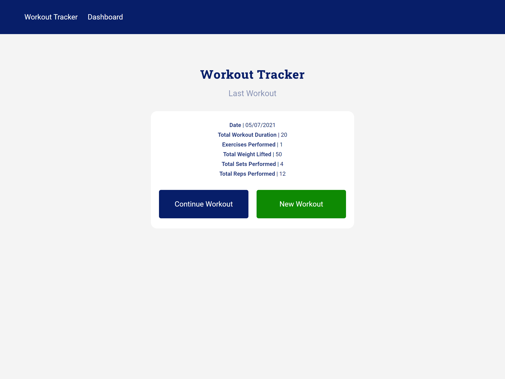
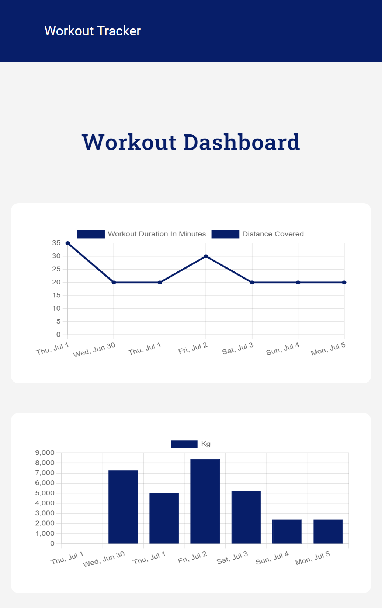
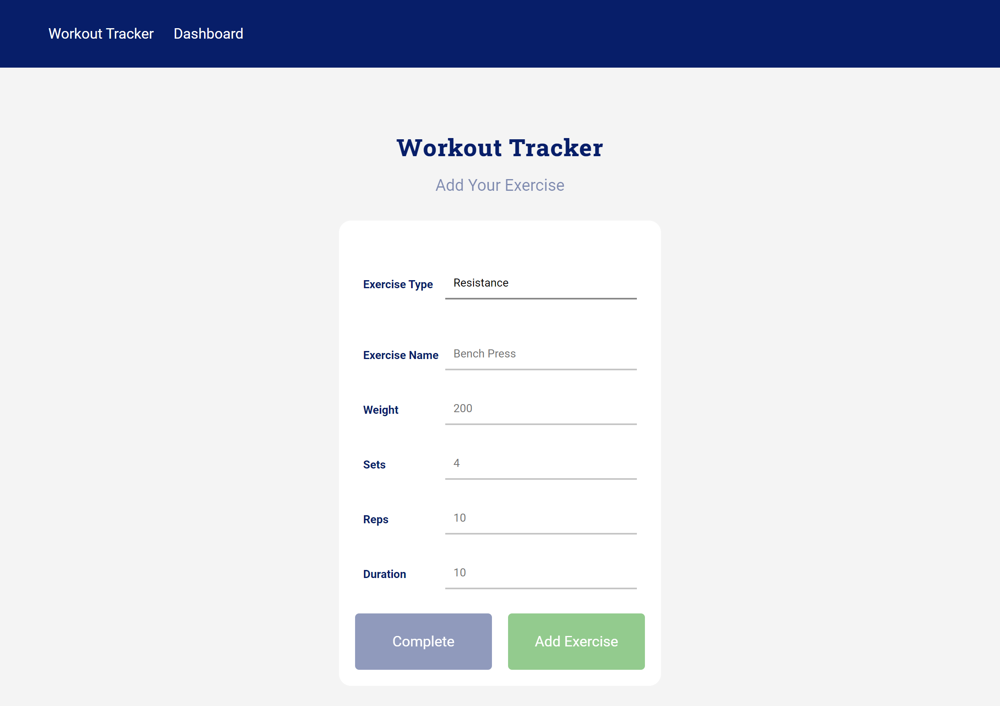

# Project Title

  <h1 align="center">Workout Tracker 👋</h1>

  

    
    
    
    

    
    
    
    
    
    

# Description

  

  Workout Tracker app

# Table of Contents

* [Installation](#-Installation)
* [Usage](#-Usage)
* [License](#-Installation)
* [Contributing](#-Contributing)
* [Tests](#-Tests)
* [Questions](#-Contact-Information)

## Front Page

## Dashboard

## New Workout

## User Story

* As a user, I want to be able to view create and track daily workouts. I want to be able to log multiple exercises in a workout on a given day. I should also be able to track the name, type, weight, sets, reps, and duration of exercise. If the exercise is a cardio exercise, I should be able to track my distance traveled.

## Business Context

A consumer will reach their fitness goals more quickly when they track their workout progress.

## Acceptance Criteria

When the user loads the page, they should be given the option to create a new workout or continue with their last workout.

The user should be able to:

* Add exercises to the most recent workout plan.

* Add new exercises to a new workout plan.

* View the combined weight of multiple exercises from the past seven workouts on the `stats` page.

* View the total duration of each workout from the past seven workouts on the `stats` page.

# Installation

  `npm install`.

  `npm run seed`.

  `npm start` (locally).

  or follow the `heroku`  link [Workout-tracker](https://workout-tracker2662.herokuapp.com/)

# Usage

  An app that lets the user track his workout

## License

  Licensed under MIT. 
  For more information, visit this link. 
  <https://opensource.org/licenses/MIT>
  
# Contributing

 solo project

# Tests

  none as of date

# Contact Information

* GitHub Username: MichaelPappas2662
* Contact Email: email@email.com
  